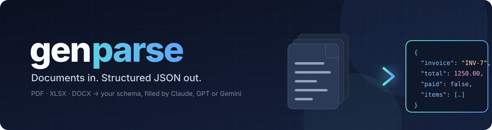

<p align="center">
  
</p>

# genparse

Upload a PDF, spreadsheet or Word file, say which fields you want as JSON, and get that JSON back filled in.
One small Rust binary: an HTTP service, a browser UI and a CLI. It talks to each model's REST API directly, no SDKs.

- **Inputs:** PDF, XLSX/XLS/ODS, DOCX
- **Models:** Claude Haiku/Sonnet/Opus/Fable, GPT Luna/Nano, Gemini Flash, DeepSeek Flash, GLM Flash (Z.ai), MiMo Flash (Xiaomi)
- **Output:** your JSON template or JSON Schema, filled, with the shape enforced by the provider's structured-output mode
- **Cache:** results keyed by file hash + model + schema, on disk, so re-uploads are instant

## Run

```sh
export ANTHROPIC_API_KEY=...    # only for the providers you use
make run                        # == cargo run --release -- serve --ui
```

Open <http://localhost:8080/ui>, drop a file, paste the fields you want, pick a model.

Flags override `config.toml`: `serve --ui --bind 0.0.0.0:9000 --model gemini-flash3.5 --cache=false`.
A model is an alias from `[models]`, a loose name like `gemini-flash3.5` or `claude-haiku` that is matched by
its words against the aliases, `provider:model-id` used verbatim, or a bare model id.

## API

```sh
curl -F file=@invoice.pdf -F schema=@examples/invoice.json -F model=flash http://localhost:8080/parse
```

Or send the file as the body, typed by `Content-Type`, with the schema in a header or query parameter:

```sh
curl --data-binary @invoice.xlsx -H 'Content-Type: application/vnd.openxmlformats-officedocument.spreadsheetml.sheet' \
     -H 'x-genparse-schema: {"total": 0.0, "vendor": ""}' 'http://localhost:8080/parse?model=flash'
```

The body is your schema filled in. Headers `x-genparse-model`, `x-genparse-cache` and `x-genparse-file-type` say what happened.
`GET /models` lists the aliases, `GET /healthz` says `ok`, `POST /cache/clear` empties the cache.

A schema is either a JSON Schema or a template where the values show the type:

```json
{ "invoice_number": "string: the invoice identifier", "issue_date": "date", "total": 0.0, "paid": false,
  "line_items": [{ "description": "", "amount": 0.0 }] }
```

## CLI

```sh
genparse extract invoice.xlsx --schema examples/invoice.json --model sonnet
genparse config    # effective configuration
```

## Docker

```sh
make docker-build && make docker-run   # serves the UI on :8080, keys from the environment
```

See `config.toml` for every setting with its default, and `make help` for the developer tasks.
Models from DeepSeek, Z.ai and Xiaomi have no file input, so they receive the document as text; scanned PDFs need Claude, GPT or Gemini.
